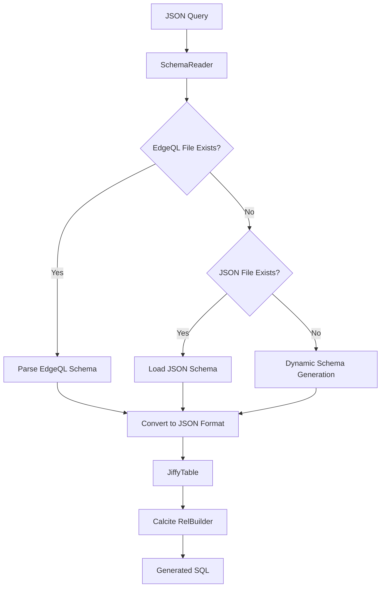

# JSON to SQL Translator

A Spring Boot application that translates JSON queries to SQL using Apache Calcite with comprehensive logging and debugging capabilities. Now supports both **EdgeQL** and **JSON** schema formats with hybrid loading priority.

## Features

- Generic JSON query translation to SQL
- **Hybrid Schema Support**: EdgeQL (.txt) and JSON (.json) schema formats
- Support for multiple SQL dialects (PostgreSQL, MySQL, Snowflake)
- RESTful API for query translation
- Comprehensive error handling and logging
- Type inference for database fields
- Detailed SQL building process visualization
- **EdgeDB Integration**: Native EdgeQL schema parsing and conversion

## Getting Started

### Prerequisites

- Java 17 or higher
- Maven 3.6+

### Running the Application

1. Build the project:
   ```bash
   mvn clean install
   ```

2. Run the application:
   ```bash
   mvn spring-boot:run
   ```

3. The application will start on `http://localhost:8088`

### API Usage

#### Translate Query

**POST** `/api/v1/translate`

Request body:
```json
{
  "query": {
    "Account": {
      "select": {
        "id": true,
        "accountNumber": true,
        "primaryOwner": {
          "select": {
            "firstName": true,
            "lastName": true
          }
        }
      },
      "filter": ["accountNumber == '1234'", "balance >= 10000"],
      "orderBy": ["desc(accountNumber)", "balance"]
    }
  },
  "dialect": "POSTGRESQL"
}
```

Response:
```json
{
  "sql": "SELECT Account_id, accountNumber, balance, primaryOwner_firstName, primaryOwner_lastName FROM Account INNER JOIN primaryOwner ON Account.primaryOwnerId = primaryOwner.id WHERE accountNumber = '1234' AND balance >= 10000 ORDER BY accountNumber DESC, balance",
  "dialect": "POSTGRESQL",
  "success": true
}
```

#### Health Check

**GET** `/api/v1/translate/health`

### Supported Dialects

- `POSTGRESQL` or `POSTGRES` (default)
- `MYSQL`
- `SNOWFLAKE`

## Schema System

The application supports both **EdgeQL** and **JSON** schema formats. **EdgeQL is used by default** with JSON as fallback for maximum compatibility:

### 📁 Schema Loading Priority

1. **EdgeQL Format**: `schemas/{tableName}.txt` (individual table files)
2. **EdgeQL Format**: `schemas/schema_sample.txt` (main EdgeQL schema file)
3. **JSON Format**: `schemas/{tableName}.json` (individual table files)
4. **JSON Format**: `schemas/default.json` (fallback schema)
5. **Dynamic Generation**: Inferred from JSON query structure

### 🎯 EdgeQL Schema Support

The application can parse **EdgeDB schema definitions** and convert them to SQL tables:

```edgeql
# Example EdgeQL schema (schema_sample.txt)
module wealthdomain {
    type Account {
        property accountNumber: std::str {
            constraint std::max_len_value(255);
            constraint std::min_len_value(0);
        };
        property balance: std::float64;
        property accountStatus: std::str;
        property isActive: std::bool;
        property createdDate: std::datetime;
        
        link primaryOwner: wealthdomain::User {
            on target delete allow;
        };
    }
}
```

**EdgeQL Type Mapping:**
- `std::str` → `VARCHAR`
- `std::int64` → `BIGINT`
- `std::float64` → `DOUBLE`
- `std::bool` → `BOOLEAN`
- `std::datetime` → `TIMESTAMP`
- `std::date` → `DATE`
- `cal::local_date` → `DATE`

### 📄 JSON Schema Support

Traditional JSON schema format is still fully supported:

```json
{
  "tableName": "Account",
  "description": "Account table schema",
  "version": "1.0",
  "fields": {
    "id": {
      "type": "INTEGER",
      "nullable": false,
      "primaryKey": true
    },
    "accountNumber": {
      "type": "VARCHAR",
      "length": 50,
      "nullable": false,
      "unique": true
    },
    "balance": {
      "type": "DECIMAL",
      "precision": 15,
      "scale": 2
    }
  }
}
```

### 🔄 Schema File Locations

Place schema files in `src/main/resources/schemas/`:

```
src/main/resources/schemas/
├── schema_sample.txt      # Main EdgeQL schema file
├── Account.txt           # Individual EdgeQL table schema  
├── Account.json          # Individual JSON table schema
├── primaryOwner.json     # JSON schema for User table
└── default.json          # Fallback JSON schema
```

### 📊 Schema Loading Logs

The application provides detailed logging about schema loading:

```
INFO  - Loaded schema for table 'Account' from main EdgeQL file: schema_sample.txt
INFO  - Loaded schema for table 'User' from JSON file: schemas/User.json  
WARN  - Using default JSON schema for table 'Unknown'
DEBUG - Converted EdgeQL type 'Account' to JSON schema with 156 fields
```

## Architecture

### 🏗️ Core Components

```
src/main/java/com/example/jsontosql/
├── schema/
│   ├── SchemaReader.java             # EdgeQL + JSON schema reader
│   └── JiffyTable.java               # Calcite table implementation
├── service/
│   ├── JsonToSqlTranslatorService.java  # Main translation service
│   └── QueryTranslator.java            # Sample query implementations
├── controller/
│   └── JsonToSqlController.java     # REST API endpoints
└── model/
    ├── QueryRequest.java            # API request model
    └── QueryResponse.java           # API response model
```

### 🔄 Schema Loading Flow



### 🎯 Key Design Decisions

- **Dual Format Support**: EdgeQL (default) and JSON schemas for maximum flexibility
- **EdgeQL Priority**: Native EdgeDB format used by default with JSON fallback
- **Format Abstraction**: Internal JSON representation unifies both schema formats
- **Clean Code**: Constants used instead of magic strings (e.g., `SELECT` constant)
- **Calcite Integration**: Leverages Apache Calcite for robust SQL generation
- **Spring Boot**: RESTful API with dependency injection and configuration management

## How SQL Building Works

The application follows a 5-step process to convert JSON queries to SQL:

### 🚀 Step 1: Creating Calcite Schema
- Creates a root schema using Apache Calcite
- Adds a "test" schema to hold table definitions
- Logs the schema creation process

### 🏗️ Step 2: Adding Tables to Schema
- Analyzes the JSON query structure
- **Loads schema definitions using hybrid approach** (EdgeQL → JSON → Dynamic)
- Creates table definitions with precise column types from schema files
- Handles nested objects as separate tables
- Logs each table being added with schema source information

### ⚙️ Step 3: Creating Framework Configuration
- Sets up Calcite's RelBuilder with the schema
- Configures the framework for SQL generation
- Logs configuration setup

### 🔧 Step 4: Building Relational Algebra
This is the core step that converts JSON structure to relational operations:

#### 📊 Table Scanning
- Starts with the main table from JSON
- Scans additional tables for joins

#### 🔗 Join Building
- Identifies nested objects in the JSON
- Creates INNER JOINs between tables
- Uses foreign key relationships (e.g., `primaryOwnerId` = `id`)
- Logs each join condition

#### 📈 Projection Building (SELECT)
- Extracts fields marked as `true` in the JSON
- Creates column aliases (e.g., `Account_id`, `primaryOwner_firstName`)
- Logs each projection added

#### 🔍 Filter Building (WHERE)
- Parses filter conditions from JSON array
- Supports operators: `==`, `>=`, `<=`, `>`, `<`
- Combines multiple conditions with AND
- Logs each filter condition

#### 📊 Order By Building (SORT)
- Processes `orderBy` array from JSON
- Supports `desc()` function for descending order
- Logs each sort condition

### 🔄 Step 5: Converting to SQL
- Uses Calcite's RelToSqlConverter
- Applies the target SQL dialect
- Generates the final SQL string
- Logs the generated SQL

## Logging Configuration

The application uses Logback with comprehensive logging:

### Console Output
- Colored output for better readability
- Shows the 5-step process with emojis
- Displays intermediate results

### File Logging
- Detailed logs saved to `logs/json-to-sql.log`
- Rolling file policy (10MB per file, 30 days retention)
- Trace-level logging for debugging

### Log Levels
- `INFO`: Main process steps and results
- `DEBUG`: Detailed operations and intermediate values
- `TRACE`: Field lookups and low-level operations
- `WARN`: Missing fields or fallback operations
- `ERROR`: Failures and exceptions

## Example JSON Query Structure

```json
{
  "TableName": {
    "select": {
      "field1": true,
      "field2": true,
      "relatedTable": {
        "select": {
          "nestedField": true
        }
      }
    },
    "filter": ["field1 == 'value'", "field2 >= 100"],
    "orderBy": ["desc(field1)", "field2"]
  }
}
```

## Error Handling

The application includes comprehensive error handling:

- **Field Not Found**: Warns when fields don't exist in schema
- **Join Failures**: Detailed error messages for invalid joins
- **Filter Parsing**: Validation of filter syntax
- **Type Inference**: Automatic SQL type mapping based on field names

## Type Inference Rules

The application automatically infers SQL types based on field names:

- **INTEGER**: Fields containing "id", "count"
- **DECIMAL**: Fields containing "balance", "amount", "price", "total"
- **TIMESTAMP**: Fields containing "date", "time"
- **BOOLEAN**: Fields containing "active", "enabled", "flag"
- **VARCHAR**: Default for all other fields

## Testing

Run tests with:
```bash
mvn test
```

## Build

Build the project:
```bash
mvn clean package
```

The JAR file will be available in the `target/` directory.

## Troubleshooting

### Common Issues

1. **NullPointerException in field lookup**: Check that all referenced fields exist in the schema
2. **Join failures**: Ensure foreign key fields follow the pattern `tableNameId`
3. **Filter parsing errors**: Use proper syntax: `field == 'value'` or `field >= 100`
4. **EdgeQL parsing errors**: Verify EdgeQL syntax matches EdgeDB standards
5. **Schema not found**: Check file paths in `src/main/resources/schemas/`
6. **Unknown EdgeQL types**: See supported type mappings in Schema System section

### EdgeQL-Specific Troubleshooting

- **Missing fields in EdgeQL**: EdgeQL schemas may have many properties; only relevant ones are extracted
- **Type conversion warnings**: Unknown EdgeQL types default to VARCHAR with warning logs
- **Implicit ID fields**: EdgeQL tables automatically get `id` fields for Calcite compatibility
- **Nested braces parsing**: Complex EdgeQL types with multiple nested `{}` are handled automatically
- **JSON fallback**: If EdgeQL parsing fails, system automatically falls back to JSON schemas

### Debug Mode

Set logging level to DEBUG or TRACE for detailed debugging:
```bash
java -jar target/json-to-sql-1.0.0.jar --logging.level.com.example.jsontosql=TRACE
```

View schema loading details:
```bash
java -jar target/json-to-sql-1.0.0.jar --logging.level.com.example.jsontosql.schema=DEBUG
```

